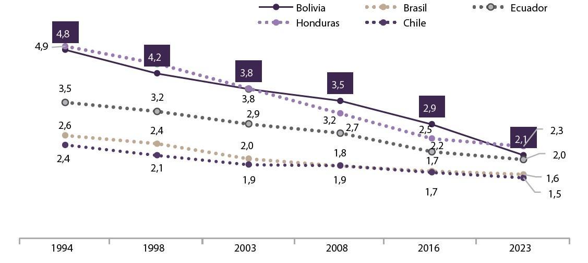
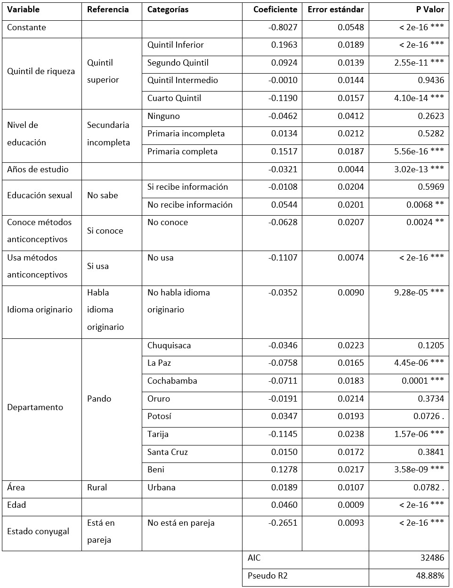
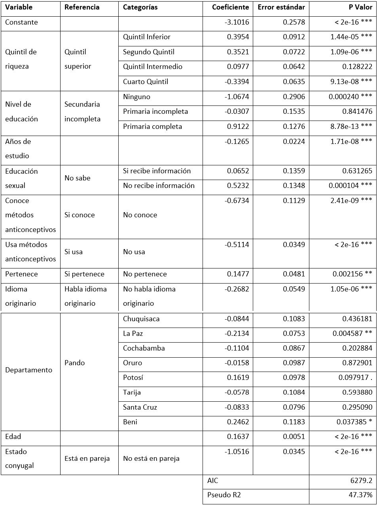
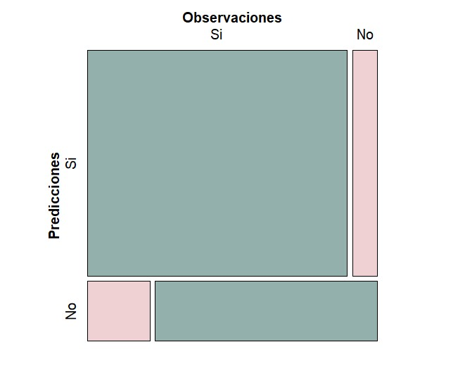
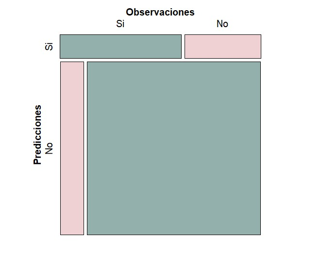

# Introducción

Según los resultados de la última Encuesta de Demografía y Salud (EDSA 2023), realizada por el Instituto Nacional de Estadística (INE), se observó una disminución en la tasa de fecundidad en Bolivia. La tasa de fecundidad en 2023 llegó a 2,1 en comparación a la tasa de 2,9 que se obtuvo en la pasada encuesta EDSA de 2016. Esta caída en la fecundidad no es una sorpresa para países dentro de la región latinoamericana y puede ser relacionada con cambios culturales, nuevas expectativas de vida por parte de la población joven y la creciente inserción al mercado laboral de la población femenina. Por otra parte, se ha visto una fuerte asociación respecto a elevados niveles de pobreza, especialmente en hogares monoparentales o rurales (UNPD, 2015), y  lo que se entiende como una alta fecundidad[^a]. 

[^a]: Según la definición por el UNPD (2015), se define alta fecundidad como haber tenido cuatro o más hijos nacidos vivos.

La Encuesta de Demografía y Salud (EDSA) constituye una fuente de información relevante al momento de obtener indicadores de salud y demografía a nivel nacional, que posteriormente ayudarán el diseño de políticas públicas implementadas en el país boliviano. La EDSA ofrece información importante para analizar la fecundidad en Bolivia, ya que permite vincular los patrones reproductivos con variables sociodemográficas, culturales y de salud, además de gozar de una cobertura a nivel nacional. De esta forma, esta encuesta actúa como fuente de información esencial para la construcción de modelos predictivos que identifican los factores más significativos asociados a la fecundidad de mujeres adultas en edad fértil [^b]  (INE & UNFPA, 2023).

[^b]: Según la definición de la EDSA (2023) considera una mujer adulta en edad fértil a aquellas mujeres entre 20 y 49 años.

En este sentido, resulta necesario analizar los factores determinantes en la fecundidad de las mujeres en Bolivia, para así poder entender de mejor forma por qué existe una tendencia a la baja respecto a la tasa de fecundidad y el número de hijos por mujer. Para tal efecto, es posible utilizar modelos estadísticos de regresión tales como la regresión logística y la regresión Poisson. Por un lado, la regresión logística permite estimar la probabilidad de ocurrencia de una variable binaria a partir de variables independientes, lo cual resulta clave para identificar factores de fecundidad. Por otro lado, la regresión Poisson permite examinar cómo varía la fecundidad en cuanto al número de hijos según características individuales como la edad, nivel educativo, actividad económica o pertenencia étnica [@schultz2006fertility].

# Objetivos

## Objetivo General
Analizar los factores determinantes en la fecundidad de las mujeres adultas y el número de hijos nacidos vivos por mujer adulta en edad fértil en Bolivia, a través de modelos de regresión logit y Poisson.

## Objetivos Específicos
-	Desarrollar el modelo de regresión logístico para explicar los determinantes de la fecundidad en las mujeres adultas en Bolivia a partir de los datos obtenidos en la encuesta EDSA 2023.

-	Desarrollar el modelo de regresión logístico para explicar los determinantes de la alta fecundidad en las mujeres adultas en Bolivia a partir de los datos obtenidos en la encuesta EDSA 2023.

-	Desarrollar el modelo de regresión de Poisson para modelar el número total de hijos nacidos vivos de las mujeres adultas en edad fértil a partir de los datos obtenidos en la encuesta EDSA 2023. 

-	Evaluar el efecto de los determinantes socioeconómicos y demográficos tales como el nivel de pobreza, educación y lugar de residencia en la fecundidad de las mujeres adultas y el número de hijos nacidos vivos de las mujeres en edad fértil en Bolivia, basado en el enfoque de Schultz (Schultz, 2006).

-	Emplear pruebas de bondad de ajuste convencionales, como ser la devianza y el criterio de información de Akaike (AIC), para la evaluación de los modelos desarrollados en la presente investigación.

# Motivación

La fecundidad constituye uno de los indicadores demográficos más relevantes dentro de la dinámica de un país, ya que influye de forma directa en el crecimiento de una población, la estructura por edades y, como consecuencia, permite diseñar políticas sociales y económicas como sean requeridas. Como menciona Schultz [@schultz2006fertility], el estudio de la fecundidad no solo se reserva a una decisión propia de una familia o persona, si no que tiene fuertes implicaciones económicas y sociales dentro de una sociedad. A partir de esto, se refuerza la influencia de la fecundidad como un factor esencial del desarrollo de un país y la importancia de comprender los factores que determinan la fecundidad dentro de una economía, para poder entender su comportamiento.

En Bolivia, tomando en cuenta los resultados presentados en la Encuesta de Demografía y Salud, se ha observado que persisten diferencias geográficas, étnicas y socioeconómicas que inciden en los patrones de fecundidad de las mujeres. Como se observa en la figura 1 y se mencionó en la sección 1, los resultados posteriores a la recolección de información para la EDSA (en sus dos versiones 2016 y 2023) muestran una tendencia a la baja en lo que compete a la tasa global de fecundidad[^c]  a nivel Bolivia. En ambos casos, se observa una disminución de 3,5 a 2,9 para el año 2016, y una reducción a 2,1 para el año 2023. Sin embargo, comparando con otros países de América Latina, se observa que desde el 2008 la tasa global de fecundidad boliviana se mantiene mayor respecto a países como Ecuador, Brasil y Chile. Aunque, como región, en todos los países se observa una tendencia decreciente. Esta reducción en la tasa global de fecundidad conduce a una población con una proporción menor de jóvenes, lo cual genera desafíos para la fuerza laboral, la sostenibilidad de los sistemas sociales y afecta directamente el crecimiento poblacional.

[^c]: La tasa global de fecundidad se entiende como el número promedio de hijos que tendrá una mujer a lo largo de su vida fértil, comprendida entre los 15 a 49 años.

```{r echo=FALSE, fig.cap="Evolución de la Tasa Global de Fecundidad en Bolivia y países de la región.\\\\\\textit{Fuente: INE, 2023 - en base a la ENDSA 1994, 1998, 2003 y 2008, EDSA 2016 y 2023, y Banco Mundial 2022.}", out.width="100%", fig.align='center'}

```

De esta forma, la investigación surge como un aporte dentro de la necesidad de generar evidencia empírica que contribuya a entender los determinantes sociales, económicos y culturales de la fecundidad en Bolivia, utilizando la Encuesta de Demografía y Salud (EDSA 2023), que además se enfoque en analizar componentes actuales dentro de esta temática. Para que así, se pueda entender de mejor forma la disminución en la tasa global de fecundidad observada en los últimos años, y se puedan plantear políticas o programas que respondan a estos resultados. Igualmente, la investigación emplea los modelos de regresión logit y Poisson, los cuales en base a su connotación teórica y práctica permiten llevar a cabo el estudio. 

# Marco Teórico

## Fecundidad y Fertilidad

La fecundidad y la fertilidad son conceptos centrales en la demografía debido a ser indicadores relevantes al analizar la dinámica demográfica y el crecimiento de una población. Aunque frecuentemente son usados como sinónimos, tienen significados distintos. Mientras que la fertilidad alude a la capacidad biológica de tener hijos, la fecundidad se refiere al número efectivo de nacimientos (Rodríguez Vignoli, 2014). De esta forma, la fecundidad se convierte en una variable clave en la planificación de políticas públicas debido a su impacto en la estructura poblacional y en la demanda de servicios educativos, sanitarios, laborales y sistemas de seguridad social (CEPAL, 2020).

Un aporte relevante al estudio de la fertilidad es realizado por T.P. Schultz (2006), quien establece una relación inversa entre el ingreso y la fecundidad. Según su análisis, a medida que aumenta el ingreso y la educación de las mujeres, la fecundidad tiende a disminuir, lo que responde tanto a la mayor participación femenina en el mercado laboral como a un cambio en las preferencias familiares respecto a la planificación reproductiva. Este enfoque ha sido retomado en estudios posteriores para explicar patrones reproductivos en países en desarrollo. En el caso de América Latina, ha atravesado una transición demográfica significativa donde se observó una reducción en las tasas de fecundidad en la región. Sin embargo, esta disminución no ha sido homogénea, ya que persisten niveles elevados en ciertos grupos poblacionales, especialmente en zonas rurales y entre mujeres con menor acceso a educación y/o servicios [@schultz2006fertility].

Por otro lado, como Schultz (2006) menciona en su capítulo “Fertility and Income”, las variables determinantes de la fecundidad femenina pueden ser fundamentadas bajo un enfoque económico y provenir de la evidencia y la teoría microeconómica. Ante esto, las principales variables que afectan la fecundidad según Schultz son: el ingreso, la educación, el uso de anticonceptivos y la planificación familiar, la mortalidad infantil, el entorno social y cultural y otras variables exógenas que pueden tomar en cuenta la edad de la mujer y el estado conyugal.

## Determinantes de la fecundidad según Schultz

El ingreso es entendido de dos formas: la primera se refiere al ingreso derivado del capital físico, como ser la tierra, que tiende a aumentar la fecundidad, pues incrementa el consumo familiar y el valor financiero inmediato de tener más hijos, y la segunda toma en cuenta el ingreso derivado del capital humano de la mujer, es decir los ingresos propios de la mujer, el cual tiende a reducir la fecundidad, debido al mayor costo de oportunidad del tiempo de la mujer con el hecho de llegar a ser madre. Por otro lado, la educación de la madre es un factor relevante ya que mayores años de escolaridad femenino están asociados de forma negativa con la tasa de fecundidad. La educación incrementa el costo de oportunidad de la maternidad y repercute de manera positiva en el status y la autonomía de la mujer [@enriquez2017determinantes].

En lo que respecta a los métodos anticonceptivos y la planificación familiar, Schultz denota que el acceso a métodos anticonceptivos reduce de forma efectiva la fecundidad para una pareja. Así mismo, Schultz indica que dicho aspecto está íntimamente ligado a la educación y la salud reproductiva dentro de una pareja. Por otro lado, al hablar de la mortalidad infantil, una reducción en este indicador genera que la esperanza por tener más hijos disminuya para una familia, lo cual reduce la fecundidad. De esta forma, se enfatiza la influencia de la supervivencia infantil en las decisiones reproductivas [@schultz2006fertility]. 

Las normas sociales y culturales sobre familia y fecundidad, así como el entorno social, condicionan las expectativas sobre el tamaño ideal del hogar; aunque Schultz se centra más en factores económicos, su análisis reconoce esta dimensión. Adicionalmente, es necesario mencionar la relevancia de esta última variable en el estudio de la fecundidad, ya que se asocia la reducción de las tasas de fecundidad a nivel de país e incluso a nivel mundial con el cambio dentro de las expectativas personales y/o profesionales dentro de los jóvenes y los nuevos ideales del tamaño familiar. Mismas variables están intrínsicamente relacionadas con la sociedad y cultura moderna [@enriquez2017determinantes].

Finalmente, pese a que Schultz no menciona a la edad y el estado conyugal de una mujer como determinantes causal principales en su modelo, estas variables pueden ser cruciales en términos del horizonte fértil y el momento de decisión de reproducción para una familia. Como tal, Schultz analiza la fecundidad acumulada por edades específicas, añadiendo así de forma implícita a la edad como parte de la estructura de oportunidades de fecundidad. Respecto al estado conyugal, el hecho de estar en pareja formal (ya se en matrimonio o convivencia) facilita o incrementa la probabilidad de tener hijos. A su vez, la decisión de formar pareja también puede verse influida por variables económicas, como el ingreso esperado o la educación.

## Alta fecundidad

La alta fecundidad se refiere a niveles por encima del reemplazo poblacional, que aproximadamente resulta ser 2.1 hijos por mujer. Entendiendo al reemplazo poblacional como el número promedio de hijos que una mujer necesita tener para que, en promedio, cada generación reemplace a la anterior en una población sin crecimiento ni disminución. Ciertos autores como Bongaarts (2015) y UNFPA (2023) toman en cuenta a la alta fecundidad para valores de la tasa global de fecundidad mayores a cuatro. En contextos como Bolivia, este fenómeno está asociado con bajos niveles educativos, pobreza, desigualdad de género, y acceso limitado a servicios tanto de salud sexual como reproductiva (UNFPA, 2023). De esta manera, como mencionan estudios recientes, se destaca que la alta fecundidad puede constituir una barrera para el desarrollo económico y la equidad, particularmente cuando se presenta en mujeres adolescentes o en grupos marginados [@binstock2014entornos].

## Regresión logística

La regresión logística es una técnica estadística utilizada para modelar relaciones entre una variable dependiente dicotómica (binaria 1/0) y un conjunto de variables independientes que pueden ser cualitativas o cuantitativas. A diferencia de la regresión lineal, este modelo estima la probabilidad de ocurrencia de un evento binario, como presencia y ausencia o éxito y fracaso, mediante la función logística, la cual garantiza que los valores predichos se encuentren entre 0 y 1.

Desde 2010, la regresión logística ha mantenido un rol central clave en investigaciones aplicadas dentro de la epidemiología, ciencias sociales y economía, como herramienta para obtener resultados importantes según los objetivos que se tengan. Según Hosmer, Lemeshow y Sturdivant (2013), la interpretación de los coeficientes de una regresión logística permite entender el cambio de las chances (odds) en la probabilidad de un evento por unidad de cambio en la variable predictora, lo cual resulta especialmente útil en contextos donde se busca analizar las posibilidades de ocurrencia de un suceso. En lo que compete al análisis de los determinantes de la fecundidad, los modelos estadísticos como la regresión logística son adecuados a la hora de modelar variables dicotómicas como "tener hijos o no".

## Regresión Poisson

La Regresión Poisson es un modelo no lineal que toma en cuenta a una variable cualitativa discreta como la variable dependiente, en general modela y predice variables de conteo. Esta regresión parte de la distribución Poisson que precisamente se utiliza para analizar conteos o números de eventos en un intervalo dado. De esta forma, en estos casos, la variable dependiente toma más de dos valores discretos no negativos (números del 0, 1, 2, en adelante). La distribución Poisson es utilizado comúnmente para modelar el número de ocurrencias de cierto evento en un medio continuo (generalmente hace referencia al tiempo), por ejemplo, es útil para modelar conteos como el número de hijos que tiene una mujer adulta en edad fértil. Siendo de esta forma un instrumento correcto para el presente estudio.

# Descripción del dataset

Los datos que se usaron para trabajar con el modelado, tanto de la regresión logística como de la regresión Poisson, fueron obtenidos a través de la última versión de la Encuesta de Demografía y Salud (EDSA), realizada por el INE en 2023. La encuesta EDSA forma parte de las investigaciones que se realizan de forma periódica y a nivel nacional, con el fin de proporcionar información para el cálculo referente a los principales indicadores de salud y demografía como ser la fecundidad, salud materna e infantil, mortalidad infantil y de niñez, vacunación, estado nutricional de los menores de seis años y anticoncepción. Posteriormente, esta información se convierte en el pilar fundamental para formular y evaluar el diseño de políticas públicas y programas que se implementen en Bolivia bajo el Plan de Desarrollo Económico y Social (PDES).

La EDSA 2023 fue realizada bajo cuatro cuestionarios temáticos: cuestionario hogar, cuestionario mujer, cuestionar hombre y el cuestionario de primera infancia, donde cada uno de ellos aborda preguntas diferentes enfocados en la población a la que se encuesta. Para motivos del análisis de datos de la investigación, se utilizaron los datos provenientes del cuestionario mujer, donde se obtiene información respectiva a los datos personales y preferencias de reproducción de las mujeres, y también la información del cuestionario hogar para obtener el ingreso de la familia (esta variable será aproximada mediante el quintil de riqueza).

Así, las variables[^d] seleccionadas de forma inicial para realizar la regresión logit y Poisson son detalladas en la figura 2. El motivo por el cual se seleccionaron estás variables va en línea con la teoría descrita por Schultz (2006) sobre los factores económicos y sociales que influyen en la tasa de fecundidad. En el caso de determinante de mortalidad infantil, no existe una variable que recoja esta información proveniente de la EDSA 2023, por lo que no será tomada en cuenta.

[^d]: El diccionario de variables de la EDSA 2023 puede ser encontrado en el catálogo ANDA.

```{r echo=FALSE, fig.cap="Descripción de las variables usadas en ambos modelos de forma inicial.\\\\\\textit{Fuente: Elaboración propia.}", out.width="90%", fig.align='center'}
knitr::include_graphics("imagenes/foto2.jpg")
```

Respecto a las variables idioma_orig y pertenece se hizo una transformación de las variables ms01_0106 (idioma o lengua que se aprendió a hablar en la niñez) y ms01_0108 (nación o pueblo originario al que pertenece). Así, la variable idioma_orig toma en cuenta si la mujer aprendió a hablar un idioma originario en su niñez como el éxito, para de esta forma conocer si la mujer nació en una familia originaria. En el caso de la variable pertenece se toma en cuenta si la mujer pertenece a un pueblo o nación originaria como el éxito, para conocer si se considera parte de un pueblo indígena.

## Regresión logit

La regresión logit para los determinantes de la fecundidad se toma en cuenta a las mujeres mayores a 19 años. La variable dependiente en este caso corresponde a una transformación sobre la variable ms02_0208, donde se toma en cuenta una variable dicotómica (denominada hijos) con el éxito cuando el número de hijos es por lo menos uno y el fracaso cuando el número de hijos es igual a cero.

En el caso de la regresión logit para analizar la alta fecundidad también se realizó transformación sobre la variable ms02_0208, pero en este caso el éxito se tomó cuando el número de hijos es por lo menos cuatro y el fracaso cuando el número de hijos es menor a cuatro.

## Regresión Poisson

La regresión Poisson se toma en cuenta a las mujeres mayores a 19 años, donde la variable dependiente en este caso corresponde a la variable ms02_0208, que representa el número de hijos vivos de una mujer.

# Metodología

El enfoque de la presente investigación es cuantitativo, debido a que se basa en la recolección y análisis de datos numéricos, a partir de la EDSA 2023, para examinar los determinantes de la fecundidad de manera objetiva. El tipo de estudio corresponde a una investigación correlacional, cuyo propósito es identificar y analizar la relación existente entre las variables que determinan la fecundidad, sin embargo no se establece causalidad directa. Igualmente, esta investigación se enmarca dentro del paradigma positivista, que sostiene que el conocimiento se obtiene a través de la observación empírica y la medición objetiva. Esto sucede dado que la investigación busca leyes generales que expliquen los fenómenos sociales y económicos de la fecundidad en Bolivia.

# Resultados y análisis

Para las tres regresiones se empleó el método de eliminación hacia atrás (backward reduction) al momento de trabajar con el software y realizar el modelado, para seleccionar las variables más relevantes, equilibrando el criterio estadístico con fundamentos la teoría económica señalada por Schultz sobre la fecundidad. De esta forma, se buscó construir un modelo parsimonioso y explicativo, sin perder variables importantes.

## Regresión Poisson
En la figura 3, se observa los resultados de la regresión Poisson donde se obtuvieron un modelo con variables significativas y un criterio de Akaike igual a 32486. Comparando con la teoría de Schultz, se observa que las variables que explican el número de hijos están asociadas con los determinantes de ingreso familiar, educación, conocimiento y uso de métodos anticonceptivos, el entorno social y cultural de la mujer, la edad y el estado conyugal.

```{r echo=FALSE, fig.cap="Resultados de la modelación Poisson..\\\\\\textit{Fuente: Elaboración propia.}", out.width="90%", fig.align='center'}

```


## Regresión Logit

En la figura 4, se observa los resultados de la regresión logit donde se obtuvieron un modelo con variables significativas y un criterio de Akaike igual a 6279.2. Comparando con la teoría de Schultz, se observa que las variables que explican la fecundidad están asociadas con los los factores del ingreso familiar y también el propio de la mujer (medido a través de la variable trabajo remunerado), educación, conocimiento y uso de métodos anticonceptivos, el entorno social y cultural (pertenencia y nacimiento de un pueblo indígena) de la mujer, la edad y el estado conyugal.

```{r echo=FALSE, fig.cap="Resultados de la modelación Logit.\\\\\\textit{Fuente: Elaboración propia.}", out.width="90%", fig.align='center'}

```

En la figura 5, se observa el mosaico de la matriz de confusión obtenida con la regresión logit realizada. De igual forma, la precisión obtenida por el modelo llega a ser del 88.38%.

```{r echo=FALSE, fig.cap="Resultados de la modelación Logit.\\\\\\textit{Fuente: Elaboración propia.}", out.width="60%", fig.align='center'}

```

## Regresión Logit para alta fecundidad

En el caso de la regresión logística para la alta fecundidad, en la figura 6 se observa los resultados de la regresión logit donde se obtuvo un modelo con variables significativas y un criterio de Akaike igual a 6994.5. Comparando con la teoría de Schultz, se observa que las variables que explican la fecundidad están asociadas con los los factores del ingreso familiar y también el propio de la mujer (medido a través de la variable trabajo remunerado), educación, conocimiento y uso de métodos anticonceptivos, el entorno social y cultural (solo tomando en cuenta al nacimiento de un pueblo indígena) de la mujer, la edad y el estado conyugal.

```{r echo=FALSE, fig.cap="Resultados de la modelación Logit para alta fecundidad.\\\\\\textit{Fuente: Elaboración propia.}", out.width="90%", fig.align='center'}
knitr::include_graphics("imagenes/foto5.jpg")
```

En la figura 7, se observa el mosaico de la matriz de confusión obtenida con la regresión logit realizada. De igual forma, la precisión obtenida por el modelo llega a ser del 84.91%.

```{r echo=FALSE, fig.cap="Resultados de la modelación Logit.\\\\\\textit{Fuente: Elaboración propia.}", out.width="60%", fig.align='center'}

```

# Conclusiones y recomendaciones

Finalmente, se logró realizar y analizar el modelo de regresión logit y Poisson para determinar los factores relevantes en la fecundidad en Bolivia. Siendo este aspecto de gran importancia para la población boliviana y la creación de políticas sociales, vista la tendencia de la tasa global de fecundidad durante los últimos años y habiendo destacado la relevancia de estos indicadores dentro de la dinámica demográfica y el crecimiento poblacional. Igualmente, se buscó analizar estos factores a través de la teoría económica y social propuesta por Schultz, la cual da grandes ideas sobre las variables que juegan un rol importante al momento de analizar la fecundidad en un país. 

De los resultados obtenidos se observó que en las tres regresiones los factores relevantes que van en coorcondancia con la teoría señalada por Schultz son el ingreso, educación, métodos anticonceptivos y planeación familiar, entorno social y cultural. Sin embargo, como variables exógenas se añadieron la edad y el estado conyugal las cuales resultaron significativas en los tres modelos. 

Como recomendaciones se resalta la importancia de llevar a cabo un estudio con datos recientes y posiblemente tomando en cuenta la variable mortalidad infantil para así analizar el efecto que tiene sobre la fecundidad en Bolivia. Igualmente, es aconsejable llevar a cabo otro estudio considerando otras variables como ser el ingreso de la familia o variables sobre la pareja de la mujer.


# Bibliography


